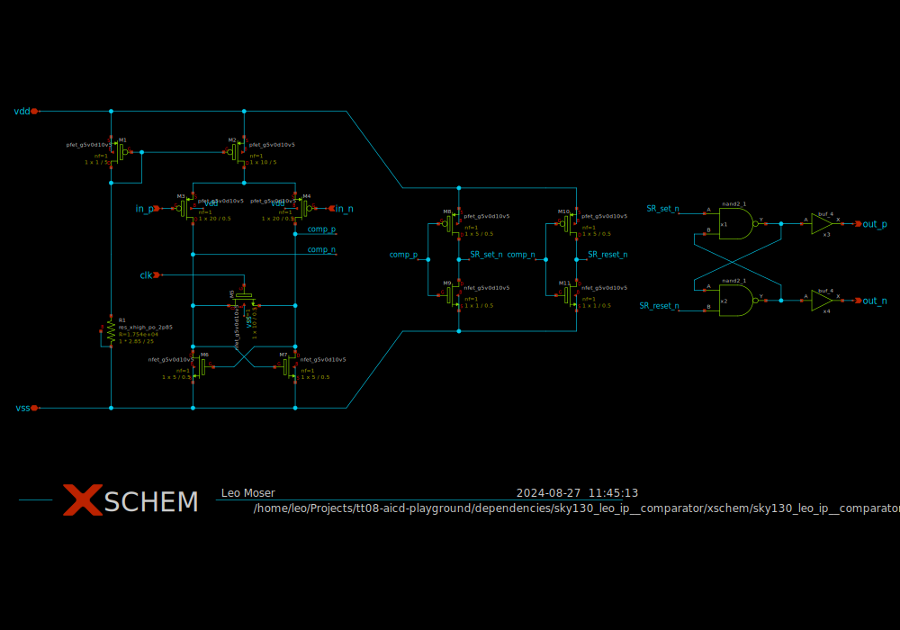

# sky130_leo_ip__comparator

- Description: A simple comparator intended for 3.3V
- PDK: sky130A

## Authorship

- Designer: Leo Moser
- Created: August 5, 2024
- License: Apache 2.0
- Company: None
- Last modified: None

## Pins

- VDD
  + Description: Analog power supply
  + Type: power
  + Direction: inout
- VSS
  + Description: Analog ground
  + Type: ground
  + Direction: inout
- CLK_N
  + Description: Clock signal
  + Type: signal
  + Direction: input
- IN_P
  + Description: Positive input
  + Type: signal
  + Direction: input
- IN_N
  + Description: Negative input
  + Type: signal
  + Direction: input
- OUT_P
  + Description: Positive output
  + Type: signal
  + Direction: output
- OUT_N
  + Description: Negative output
  + Type: signal
  + Direction: output

## Default Conditions

- vdd
  + Description: Analog power supply voltage
  + Display: Vdd
  + Unit: V
  + Typical: 3.3
- cl
  + Description: Output load capacitance
  + Display: CLoad
  + Unit: fF
  + Maximum: 10
- corner
  + Description: Process corner
  + Display: Corner
  + Typical: tt
- temperature
  + Description: Ambient temperature
  + Display: Temp
  + Unit: °C
  + Typical: 27

## Symbol

## Schematic

## Layout

